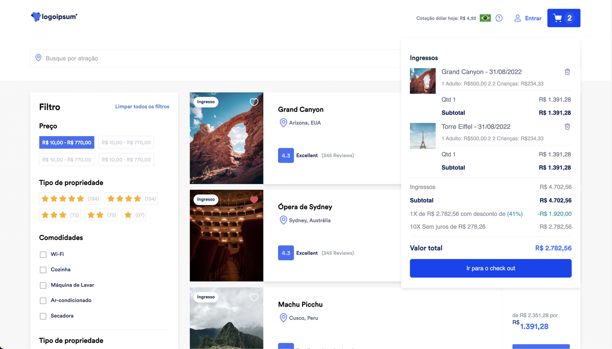

<h1 align="center"> <a href="https://travel.vertocode.com" target="_blank">Ticket Travel</a></h1>

<p align="center">
    
</p>

## Principal Links
- [Deployed App 🚀](https://travel.vertocode.com)
- [Video Demo ▶️](https://www.youtube.com/watch?v=mqPURm2KrIg&t=2s)

## Jump To
- [Introduction](#introduction)
- [Features](#features)
- [Technologies](#technologies)
- [Installation](#installation)
- [Folder Structure](#folder-structure)
- [How to run unit tests](#how-to-run-tests)
- [How to run e2e tests](#how-to-run-e2e-tests)
- [How to run lint](#how-to-run-lint)
- [How to run storybook](#how-to-run-storybook)
- [License](#license)

## Introduction

Ticket Travel is a web application that allows users to book tickets for travel.

It was created as a challenge project for [JustTravel](https://justtraveltour.com/en) in a selective process.



## Features
- This was built following the Figma design provided by JustTravel.
- Users can see a list of available tickets from API provided by JustTravel.
- Users can search for specified tickets by Name, or Location.
- Users can access the details of a ticket.
- Users can book a ticket clicking on "Comprar Ingresso" in the ticket details page.
- Users can access their booked tickets in the cart menu clicking on the cart button in the header.
- Users can remove a ticket from the cart.
- Users can see the subtotal, total price, and installment value of the tickets in the cart.
- Users can increase the quantity of a ticket booking more than one ticket.

## Technologies

- [React](https://reactjs.org/)
- [Next.js](https://nextjs.org/)
- [Redux](https://redux.js.org/)
- [TypeScript](https://www.typescriptlang.org/)
- [SASS](https://sass-lang.com/)
- [Storybook](https://storybook.js.org/)
- [Vitest](https://vitest.dev/)
- [React Testing Library](https://testing-library.com/docs/react-testing-library/intro/)
- [Cypress](https://www.cypress.io/)
- [ESLint](https://eslint.org/)
- [MUI](https://mui.com/)

## Installation

1. Clone the repository
```bash
git clone git@github.com:vertocode/ticket-travel.git
```

2. Install the dependencies
```bash
npm run i
```

3. (Optional) You can set the environment variables to use the real time dollar value in the header. If it's not set, the application will use a fixed value of R$ 5.53.

```bash 
cp .env.sample .env
```

Open the `.env` file and set the `EXCHANGE_RATE_API_KEY` value. You can get it [here](https://www.exchangerate-api.com/).

4. Run the application
```bash
npm run dev
```

## Folder Structure

| Folder | Description                                               |
|------------|-----------------------------------------------------------|
| /app       | The main application folder, where the pages are located.|
| /components | The components used in the application.                   |
| /lib       | The application libraries config, as Redux is being used there.|
| /assets    | The application assets.                                   |
| /public    | The public folder, where the logo, and images are located.|
| /hooks     | The application React custom hooks.                       |
| /utils     | The application utils where we have the common functions. |
| /styles    | All the application styles.                               |
| /vitest    | The unit tests.                                           |
| /cypress   | The end-to-end tests.                                     |
| /types     | The application types to use with TypeScript.             |
| /services  | The application services, where we have the API calls.    |
| /stories   | The Storybook stories.                                    |
| /.storybook | The Storybook configuration.                              |

# How to run unit tests

```bash
npm run test
```

# How to run e2e tests

To run the e2e tests in the browser, you can use the following command:

```bash
npm run cypress:open
```

To run the e2e tests in the headless mode, you can use the following command:

```bash
npm run cypress:run
```

# How to run lint

```bash
npm run lint
```

# How to run storybook

```bash
npm run storybook
```

## License

This project is licensed under the MIT License. See the [LICENSE](LICENSE) file for details.